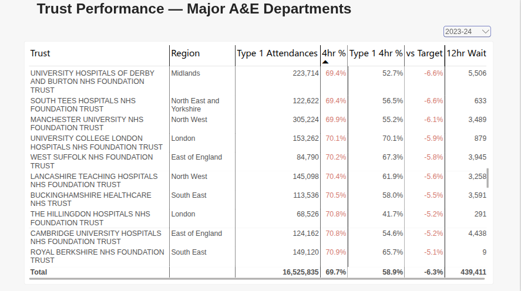
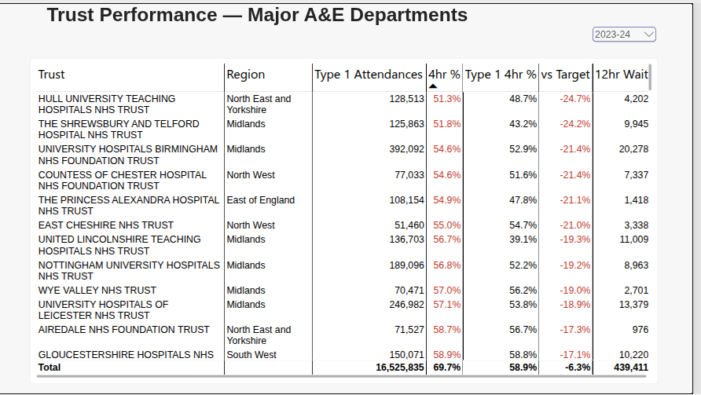
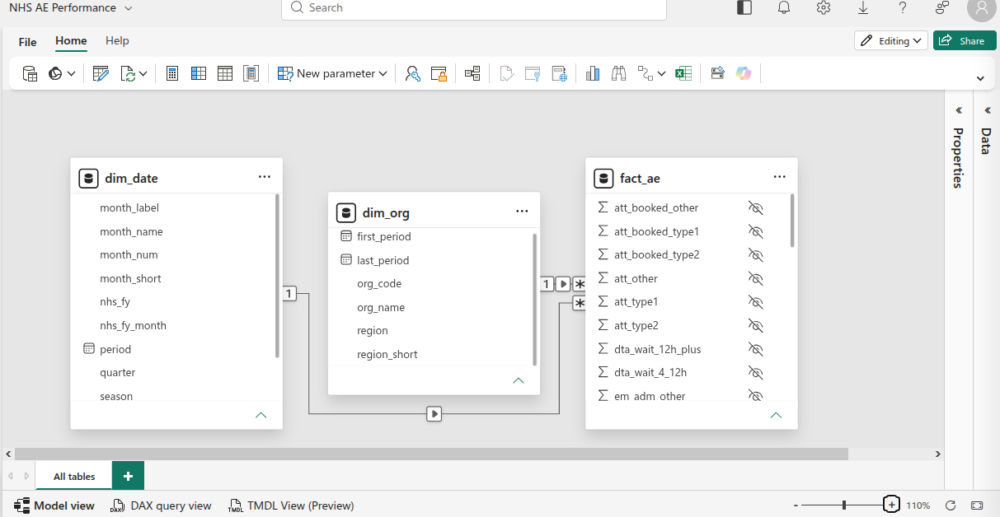

# NHS A&E Performance Dashboard

> **Status:** data pipeline, semantic model, DAX measures and two report pages complete and validated. Includes an in-depth case study of Wrightington, Wigan and Leigh.

An end-to-end analytics project tracking A&E performance in England against the 4-hour standard. It combines a Python data pipeline (download, clean, reconcile, validate) with a Power BI star-schema model, a KPI dashboard and a written investigation.

**Read the case study:** [Wrightington, Wigan and Leigh: why the headline hides the pressure (PDF)](docs/WWL_AE_case_study.pdf)

## Business brief

**Stakeholder (simulated):** Regional Urgent & Emergency Care Performance Lead.

**Questions the dashboard answers:**

1. What share of patients are seen within 4 hours, and how far is performance from target?
2. Which trusts are consistently underperforming, and which have improved?
3. How large is winter pressure, and when does it start?
4. How many patients wait over 4 and 12 hours from decision to admit?

## Data

- **Source:** NHS England, *Monthly A&E Attendances and Emergency Admissions*, trust-level CSVs
- **Coverage:** January 2021 to September 2026 (69 months), 233 organisations, 7 NHS regions
- **Licence:** Contains public sector information licensed under the Open Government Licence v3.0

## Dashboard

### National Overview



Headline KPIs for the selected NHS year (4-hour performance, target, variance, major A&E performance and 12-hour waits), coloured Red, Amber or Green against target, plus a month-by-month chart comparing this year, last year and the target.

### Trust League Table



Every trust with a major (Type 1) A&E, ranked by 4-hour performance, with major A&E performance, variance to target and 12-hour waits. Walk-in and urgent care centres are excluded so trusts are compared like with like.

## Case study: Wrightington, Wigan and Leigh

The league table showed WWL with an ordinary headline score (68.7% in 2023-24) but one of the lowest major A&E scores in England (47.3%). The investigation, written up in full in [`docs/WWL_AE_case_study.pdf`](docs/WWL_AE_case_study.pdf), found:

- **The headline hides the pressure.** WWL's urgent treatment centres see about 99% of patients within 4 hours, which lifts the trust average well above its major A&E at Wigan Infirmary (about 50%).
- **It is WWL-specific, not only national.** From 2023-24 the major A&E ran 5–9 points below the North West and 8–12 points below England every year.
- **It was not caused by more arrivals.** Major A&E visits fell by about 14% while performance worsened.
- **Bed access was the clearest pressure point.** From 2023-24 to 2025-26, WWL patients were almost twice as likely as the English average to wait over 12 hours for a bed.
- **Genuine recent improvement, and a remaining problem.** Comparing April–September 2026 with the same months of 2025, 12-hour bed waits fell by 43% while England's rate rose, but the major A&E's 4-hour score fell by a further 4.3 points.

The PDF includes the full tables, charts, benchmarks, limitations, recommended next steps and a glossary of terms.

## Pipeline

| Step | Script | What it does |
|---|---|---|
| 1. Download | `scripts/download_nhs_ae.py` | Scrapes every NHS financial-year page from the start date and downloads each monthly CSV with a consistent, sortable filename. Skips files already downloaded. |
| 2. Clean & model | `scripts/clean_nhs_ae.py` | Combines all files, fixes data issues, reconciles to NHS totals, and outputs a star schema (`fact_ae`, `dim_org`, `dim_date`) for Power BI. |

### Data quality issues found and handled

| Issue | How it was handled |
|---|---|
| July 2021 link text missing "A&E" on the source page, so it was silently skipped | Matching rule changed from exact wording to reliable signals (monthly + CSV + month/year) |
| September 2024 file had 6 extra empty columns (one named "a") | Investigated (all empty), then excluded by keeping only the 22 known columns |
| National TOTAL rows in every file, spelled inconsistently ("TOTAL", "Total", "TOTAl") | Separated from detail rows to prevent double counting, then used for reconciliation |
| February 2026 TOTAL row stored in the organisation columns instead of Period | Detection extended to all label columns; caught by a dimension-value check |
| Trailing spaces in region names; typo in a source header | Trimmed and renamed to clean, consistent column names |
| Excel metadata dates written as `...+00:00Z` by openpyxl 3.1.2, which Power BI rejects | Script repairs the workbook metadata after writing |
| Power Query auto-detected the text label "Jan 2021" as a date | Column type corrected to Text |

## Data model



A **star schema**: one fact table surrounded by dimension tables.

| Table | Grain | Role |
|---|---|---|
| `fact_ae` | One row per organisation per month (13,916 rows) | The numbers: attendances, 4-hour breaches, admission waits, admissions |
| `dim_org` | One row per organisation (233) | Organisation name, NHS region |
| `dim_date` | One row per month (69) | Calendar fields plus NHS financial year (April–March) and season |

**Why a star schema:**

- **Correct totals at every level.** Dimensions filter the fact table through one-to-many relationships, so a figure is right whether it is viewed nationally, by region, by trust or by month.
- **Single-direction filtering.** Filters flow from dimensions to the fact table only, which avoids ambiguous filter paths and unexpected totals.
- **No repeated descriptive data.** Organisation names and regions are stored once in `dim_org` instead of on every one of ~14,000 fact rows, keeping the model small and fast.
- **One place to change things.** Renaming a region or adding a date attribute happens in one dimension table and flows to every visual.
- **It is the structure Power BI is optimised for**, and the standard design for analytical models.

**Model hygiene:**

- Relationship keys and all raw numeric columns are hidden, so report users can only use the validated measures.
- `month_label` sorts by a numeric `year_month_sort` key, so months appear in date order rather than alphabetically.
- Label-like numbers (`year`, `month_num`) are set to *Don't summarize*.
- The full model definition, including every measure, is in [`model/nhs_ae_performance.tmdl`](model/nhs_ae_performance.tmdl).

**Known limitation:** the model was built in Power BI online, where Power BI's *Auto date/time* setting created hidden date tables for each date column. They do not affect any measure (all time logic uses `dim_date`), but in Power BI Desktop this setting would be turned off.

## DAX measures

| Group | Measures |
|---|---|
| **Core KPI** | Total Attendances, Attendances Over 4 Hours, **4hr Performance %** |
| **Major A&E (Type 1)** | Type 1 Attendances, Type 1 Over 4 Hours, **Type 1 4hr Performance %** |
| **Target tracking** | 4hr Target % (by NHS financial year), **Variance to Target**, **RAG Status**, RAG Colour |
| **Patient flow** | 12hr Waits from Decision to Admit, 4-12hr Waits from Decision to Admit, Emergency Admissions via A&E, Total Emergency Admissions |
| **Time intelligence** | 4hr Performance % LY, **4hr Performance YoY Change**, Total Attendances LY, **Attendances YoY %** |

**Design choices:**

- Measures are built from other measures (e.g. `4hr Performance %` uses `[Total Attendances]`), so each definition lives in one place.
- `DIVIDE()` is used instead of `/` to return blank rather than an error when a denominator is zero.
- **Targets follow NHS planning guidance:** 76% (2023-24), 78% (2024-25 and 2025-26), 82% (2026-27). Years before 2023-24 had no interim target, so variance and RAG are left blank rather than invented.
- **RAG rule:** Green at or above target; Amber up to 5 percentage points below; Red more than 5 points below. A single `RAG Colour` measure drives the colours on every visual.
- Year-on-year uses `DATEADD(..., -12, MONTH)`, matching the monthly grain of `dim_date`. Performance YoY is reported as a change in **percentage points**; attendance YoY as **percentage growth**.

## Validation

| Check | Result |
|---|---|
| Completeness | 69 of 69 months downloaded |
| Reconciliation | Sum of organisations matches NHS England's TOTAL rows for all 69 months, attendances and over-4-hour counts, zero variance |
| 4hr Performance % (Sep 2026) | **74.4%** in Python and DAX, matching NHS England's published figure |
| Type 1 4hr Performance % (Sep 2026) | **60.6%**, matching the published figure; confirms NHS includes booked Type 1 appointments |
| Total Emergency Admissions (Aug 2026) | **517,868**, matching the published figure; confirms NHS's headline counts all admission routes |
| Year-on-year logic | Prior-year values checked month by month (e.g. Jan 2022 LY = Jan 2021); 2021 correctly blank |
| Cross-page consistency | 12-hour waits for 2023-24 = 439,411 on both report pages |

## Key findings

- **Performance is improving slowly, but the target is rising faster.** 4-hour performance rose from 72.6% (2023-24) to 75.4% (2026-27 to date), but 2026-27 is the first year rated **Red**, because the target increased from 78% to 82%.
- **The headline hides the pressure on major A&Es.** In September 2026, 74.4% of all patients were seen within 4 hours, but only **60.6%** in major (Type 1) departments.
- **Very few trusts met the target.** In 2023-24, only two trusts with a major A&E reached the 76% target (Epsom and St Helier, and St George's).
- **Winter is consistently the weakest period.** December 2022 (69.0%) is the lowest month in the dataset.
- **Demand is outpacing improvement.** Since June 2026, performance has been below the same month in 2025 while attendances are up 3–6% year on year.
- **Base effects:** early-2022 attendance growth of over 40% reflects comparison with lockdown months in 2021, not a genuine surge.
- **Data-quality note:** a few trusts report zero 12-hour waits despite high activity; this may reflect reporting practice rather than performance.

## Reproduce it

```bash
python3 scripts/download_nhs_ae.py
python3 scripts/clean_nhs_ae.py
```

Requires Python 3 with `requests`, `beautifulsoup4`, `pandas` and `openpyxl`. Then import `data/clean/nhs_ae_model.xlsx` into Power BI and apply the model definition in `model/`.

## Repository structure


## Next steps

- [x] Python data pipeline with reconciliation and validation
- [x] Power BI semantic model: star schema, relationships, DAX measures
- [x] Report pages: National Overview, Trust League Table
- [x] Case study: Wrightington, Wigan and Leigh
- [ ] Trust detail (drill-through) page
- [ ] Trends page covering all 69 months
- [ ] Video walkthrough

---
*Independent research by Pius Ajamma.*
